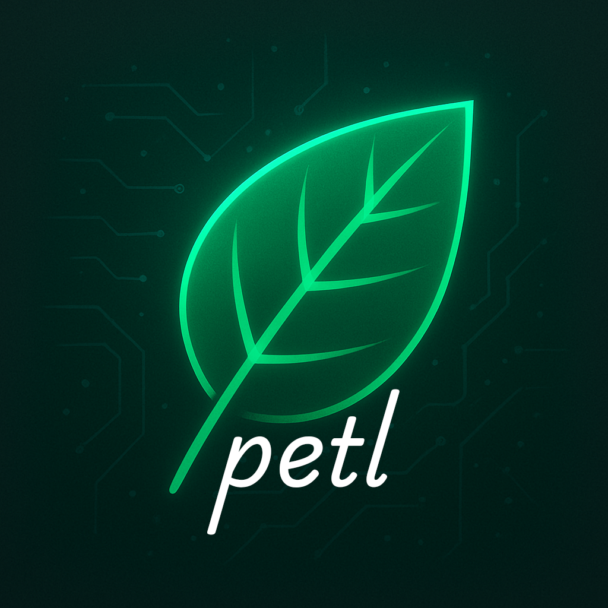

<div style="text-align:center;">



</div>

# Petl

A Programmable ETL (Extract, Transform, Load) Library designed around using a fluent interface to transform data from inputs to outputs.

## Features

- **Fluent Interface**: Easy-to-use builder pattern for creating transformation pipelines
- **Property Transformations**: Simple type-to-type data copying between properties
- **Custom Transformations**: Support for custom transformation logic with callback handlers
- **Pipeline Steps**: Organize transformations into logical steps
- **Type Safety**: Full generic type support for compile-time safety

## Quick Start

```csharp
using Petl;

// Define your input and output models
public class InputModel
{
    public string SourceProperty { get; set; } = string.Empty;
    public int SomeProperty { get; set; }
}

public class OutputModel
{
    public string TargetProperty { get; set; } = string.Empty;
    public string SomeProperty { get; set; } = string.Empty;
}

// Create a transformation pipeline
var builder = new PipelineBuilder<InputModel, OutputModel>();

builder
    .WithStep("Simple Transform")
        .Property(
            x => x.SourceProperty,
            y => y.TargetProperty
        )
        .Transform((source, target) => {
            target.SomeProperty = source.SomeProperty.ToString();
        });

var pipeline = builder.Build();

// Execute the transformation
var myInput = new InputModel
{
    SourceProperty = "Hello World",
    SomeProperty = 42
};
var myOutput = new OutputModel();

pipeline.Exec(myInput, myOutput);
```

## API Reference

### PipelineBuilder<TSource, TTarget>

The main entry point for creating transformation pipelines.

- `WithStep(string stepName)`: Creates a new transformation step
- `Build()`: Builds the pipeline

### TransformationStep<TSource, TTarget>

Represents a single step in the transformation pipeline.

- `Property(Expression<Func<TSource, object?>> sourceProperty, Expression<Func<TTarget, object?>> targetProperty)`: Maps a source property to a target property
- `Transform(Action<TSource, TTarget> transformAction)`: Applies custom transformation logic

### Pipeline<TSource, TTarget>

The executable pipeline that performs the transformations.

- `Exec(TSource source, TTarget target)`: Executes the transformation pipeline
- `StepCount`: Gets the number of transformation steps
- `StepNames`: Gets the names of all transformation steps

## License

This project is part of the Petl ETL library.
