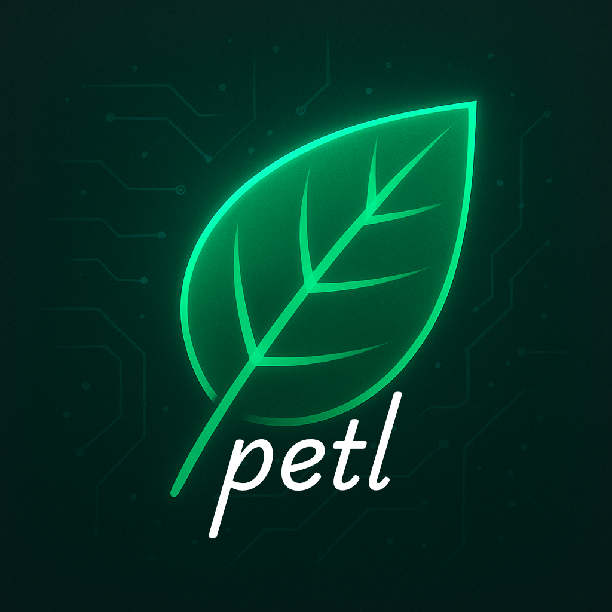

<div style="text-align:center;">



</div>

# Petl

A Programmable ETL (Extract, Transform, Load) Library designed around using a fluent interface to transform data from inputs to outputs.

## Features

- **Fluent Interface**: Easy-to-use builder pattern for creating transformation pipelines
- **AutoMap**: Automatically map matching properties between source and target with zero configuration
- **Property Transformations**: Simple type-to-type data copying between properties
- **Custom Transformations**: Support for custom transformation logic with callback handlers
- **Pipeline Steps**: Organize transformations into logical steps
- **Dependency Injection**: First-class support for ASP.NET Core and Microsoft.Extensions.DependencyInjection
- **Type Safety**: Full generic type support for compile-time safety

## Installation

```bash
dotnet add package Petl.Core
```

## Quick Start

### The Simplest Approach: AutoMap

When your source and target types share properties with the same names and types, use `WithAutoMapStep()` for zero-configuration mapping:

```csharp
using Petl;

public class UserDto
{
    public string Name { get; set; }
    public int Age { get; set; }
    public string Email { get; set; }
}

public class UserViewModel
{
    public string Name { get; set; }
    public int Age { get; set; }
    public string Email { get; set; }
}

// One line to map all matching properties!
var pipeline = new PipelineBuilder<UserDto, UserViewModel>()
    .WithAutoMapStep()
    .Build();

var dto = new UserDto { Name = "John", Age = 30, Email = "john@example.com" };
var viewModel = new UserViewModel();

pipeline.Exec(dto, viewModel);
// viewModel now has all values from dto
```

### AutoMap with Additional Transformations

Combine automatic mapping with custom logic:

```csharp
var pipeline = new PipelineBuilder<UserDto, UserViewModel>()
    .WithAutoMapStep()
    .WithStep("Post-Processing")
        .Transform((source, target) => {
            target.Name = target.Name.ToUpper();
        })
    .Build();
```

### AutoMap with Filtering

Control which values get copied using a filter callback:

```csharp
var pipeline = new PipelineBuilder<UserDto, UserViewModel>()
    .WithAutoMapStep((source, target, value) => {
        // Only copy non-null, non-empty values
        if (value is string str)
            return !string.IsNullOrEmpty(str);
        return value != null;
    })
    .Build();
```

### Manual Property Mapping

For more control, map properties explicitly:

```csharp
var builder = new PipelineBuilder<InputModel, OutputModel>();

builder
    .WithStep("Transform User Data")
        .Property(x => x.FirstName, y => y.FullName)
        .Property(x => x.BirthYear, y => y.Age)
        .Transform((source, target) => {
            target.DisplayName = $"{source.FirstName} ({source.Age})";
        });

var pipeline = builder.Build();
```

## Dependency Injection

Petl integrates seamlessly with ASP.NET Core and any application using `Microsoft.Extensions.DependencyInjection`.

### Basic Setup

```csharp
// In Program.cs or Startup.cs
builder.Services.AddPetl()
    .WithPipeline<UserDto, UserViewModel>(pipeline =>
    {
        pipeline.WithAutoMapStep();
    });
```

### Inject and Use

```csharp
public class UserService
{
    private readonly Pipeline<UserDto, UserViewModel> _pipeline;

    public UserService(Pipeline<UserDto, UserViewModel> pipeline)
    {
        _pipeline = pipeline;
    }

    public UserViewModel ToViewModel(UserDto dto)
    {
        var viewModel = new UserViewModel();
        _pipeline.Exec(dto, viewModel);
        return viewModel;
    }
}
```

### AutoMapping with DI

Register auto-mapped pipelines with a single line:

```csharp
builder.Services.AddPetl()
    .WithAutoMapping<UserDto, UserViewModel>();
```

Or with additional configuration:

```csharp
builder.Services.AddPetl()
    .WithAutoMapping<UserDto, UserViewModel>(pipeline =>
    {
        pipeline.WithStep("Normalize")
            .Transform((source, target) => target.Email = target.Email.ToLower());
    });
```

### Named/Keyed Services

Register multiple pipelines for the same types using keyed services:

```csharp
builder.Services.AddPetl()
    .WithPipeline<UserDto, UserViewModel>("Summary", pipeline =>
    {
        pipeline.WithStep("Summary")
            .Property(x => x.Name, y => y.Name);
    })
    .WithPipeline<UserDto, UserViewModel>("Full", pipeline =>
    {
        pipeline.WithAutoMapStep();
    });
```

Inject with `[FromKeyedServices]`:

```csharp
public class UserService
{
    public UserService(
        [FromKeyedServices("Summary")] Pipeline<UserDto, UserViewModel> summaryPipeline,
        [FromKeyedServices("Full")] Pipeline<UserDto, UserViewModel> fullPipeline)
    {
        // Use different pipelines for different scenarios
    }
}
```

### Full DI Options

```csharp
builder.Services.AddPetl()
    // Simple auto-mapping
    .WithAutoMapping<SourceA, TargetA>()
    
    // Auto-mapping with filter
    .WithAutoMapping<SourceB, TargetB>((src, tgt, val) => val != null)
    
    // Auto-mapping with additional steps
    .WithAutoMapping<SourceC, TargetC>(pipeline =>
    {
        pipeline.WithStep("Extra").Transform((s, t) => t.Processed = true);
    })
    
    // Keyed auto-mapping with filter and additional steps
    .WithAutoMapping<SourceD, TargetD>(
        name: "CustomMapper",
        filter: (src, tgt, val) => val != null,
        configure: pipeline =>
        {
            pipeline.WithStep("Finalize")
                .Transform((s, t) => t.Name = t.Name.Trim());
        })
    
    // Custom pipeline
    .WithPipeline<SourceE, TargetE>(pipeline =>
    {
        pipeline.WithStep("Manual")
            .Property(x => x.Id, y => y.Identifier)
            .Property(x => x.Value, y => y.Amount);
    });
```

## API Reference

### PipelineBuilder<TSource, TTarget>

The main entry point for creating transformation pipelines.

| Method | Description |
|--------|-------------|
| `WithStep(string stepName)` | Creates a new transformation step |
| `WithAutoMapStep(string stepName = "AutoMap")` | Auto-maps all matching properties |
| `WithAutoMapStep(Func<TSource, TTarget, object?, bool> filter, string stepName = "AutoMap")` | Auto-maps with a filter callback |
| `Build()` | Builds the pipeline |

### TransformationStep<TSource, TTarget>

Represents a single step in the transformation pipeline.

| Method | Description |
|--------|-------------|
| `Property(...)` | Maps a source property to a target property |
| `Transform(Action<TSource, TTarget> transformAction)` | Applies custom transformation logic |

### Pipeline<TSource, TTarget>

The executable pipeline that performs the transformations.

| Property/Method | Description |
|-----------------|-------------|
| `Exec(TSource source, TTarget target)` | Executes the transformation pipeline |
| `StepCount` | Gets the number of transformation steps |
| `StepNames` | Gets the names of all transformation steps |

### ServiceCollectionExtensions

Extension methods for dependency injection.

| Method | Description |
|--------|-------------|
| `AddPetl()` | Adds Petl support, returns `PetlBuilder` |

### PetlBuilderExtensions

Methods for registering pipelines with DI.

| Method | Description |
|--------|-------------|
| `WithPipeline<TSource, TTarget>(configure)` | Registers a custom pipeline |
| `WithPipeline<TSource, TTarget>(name, configure)` | Registers a keyed custom pipeline |
| `WithAutoMapping<TSource, TTarget>(...)` | Registers an auto-mapped pipeline (multiple overloads) |

## License

This project is part of the Petl ETL library.
